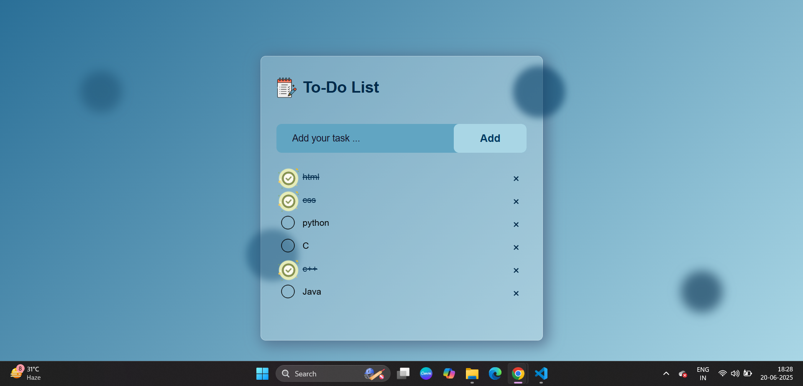

# To-Do-List
A clean and minimal To-Do List web app that helps you stay organized and focused.
Built using **HTML, CSS, and JavaScript**, this app allows users to:

✅ Add new tasks  
🗑️ Delete unwanted tasks  
✔️ Mark tasks as completed  
🎯 Track progress with a simple UI

---

## 🚀 Features

- **Add Tasks:** Easily add what you need to do.
- **Delete Tasks:** Remove tasks that are no longer needed.
- **Mark Complete:** Click to mark tasks as completed.
- **Dynamic UI:** Changes instantly without refreshing the page.
- **Clean Design:** User-friendly and distraction-free layout.

---

## 🌐 Live Demo

🔗 [Check out the Live Demo](http://127.0.0.1:5500/html/ToDo%20List/index.html)  

---

## 🛠️ Tech Stack

- HTML  
- CSS  
- JavaScript (Vanilla)

---

## 📸 Preview

  

Open index.html in your browser

Start managing your tasks!

🙋‍♀️ Made with 💻 by [Prerna Tiwari]
Feel free to ⭐ star, fork 🍴, or contribute!
